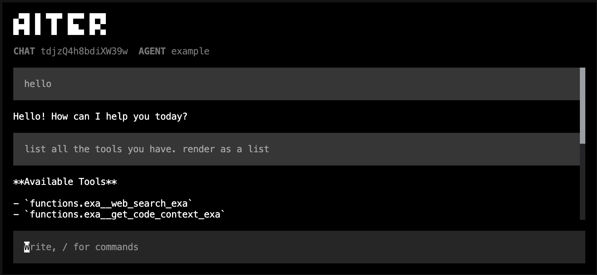
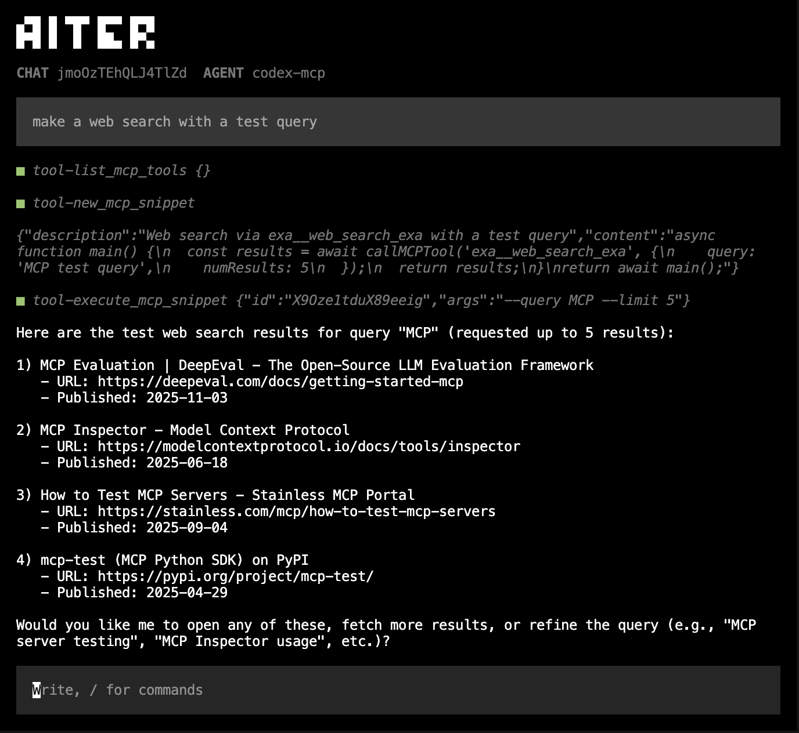

# aiter-app



Built with aiter ([github.com/pranftw/aiter](https://github.com/pranftw/aiter))

## Installation
```bash
git clone https://github.com/pranftw/aiter-app.git
cd aiter-app
bun install
cp .env.template .env # add the envvars
bun run src/index.tsx -a <AGENT_NAME>
```

## Agents

### Code Execution with MCP: A Dynamic Approach (codex-mcp)



```bash
bun run src/index.tsx -a codex-mcp
```

The Anthropic blog post [Code Execution with MCP](https://www.anthropic.com/engineering/code-execution-mcp) demonstrates how agents can use code execution to interact with MCP servers more efficiently, avoiding the token overhead of loading all tool definitions upfront. Their approach generates `.ts` files for each tool to enable progressive discovery.

#### The Filesystem Approach Challenges

Generating and maintaining tool files creates significant overhead:

- **Initial generation complexity**: For each MCP tool, generate a TypeScript file with correct interfaces, types, and exports
- **Type system management**: Handle optional parameters, union types, nested objects, arrays, and complex schemas across hundreds of files
- **Synchronization burden**: When a tool's schema changes on the MCP server, all generated files must be regenerated
- **Build pipeline overhead**: Requires compilation, bundling, and distribution of generated code
- **Version conflicts**: Different MCP servers may update at different times, causing mismatches between generated files and actual tool definitions
- **Disk space**: Thousands of tools = thousands of files to store, version control, and distribute

**codex-mcp** eliminates all of this. Everything is dynamic and in-memory. Tools are always in sync because they're accessed directly from the live MCP connection.

This dynamic execution approach is made possible by [Vercel AI SDK](https://github.com/vercel/ai)'s comprehensive MCP support, which provides the runtime infrastructure to call MCP tools directly from code.

#### Progressive Tool Discovery (No Filesystem)

Two lightweight tools replace file exploration:

```typescript
// Discover available tools
list_mcp_tools() 
→ ['exa__search', 'gdrive__get_document', 'salesforce__update_record', ...]

// Load only what you need
get_mcp_tool_details('gdrive__get_document')
→ { description, inputSchema, outputSchema }
```

Same progressive loading behavior, zero files generated.

#### In-Memory Snippet Execution

Snippets stored directly in chat session data:

```typescript
// Create
new_mcp_snippet({
  description: 'Sync Google Drive to Salesforce',
  content: `
    async function main() {
      const doc = await callMCPTool('gdrive__get_document', { docId: 'abc123' });
      await callMCPTool('salesforce__update_record', { 
        recordId: 'xyz',
        data: { notes: doc.content }
      });
      return 'Synced successfully';
    }
    return await main();
  `
})

// Execute instantly
execute_mcp_snippet({ id: 'abc123' })
```

The `callMCPTool` function is injected directly into the execution environment: no imports, no filesystem, pure runtime injection.

#### Meta-Agent Capabilities with callLLM

Snippets have access to `callLLM`, which unlocks powerful metaprogramming capabilities:

**Dynamic Agent Composition**: Agents can programmatically author and execute specialized sub-agents with custom system prompts, tool sets, and reasoning strategies. This enables recursive agent architectures where LLMs design their own multi-stage workflows.

**Intelligent Tool Output Processing**: Rather than passing large MCP tool results directly to context, agents can invoke `callLLM` to process, filter, and extract only relevant information within the execution environment. This preserves context efficiency while maintaining the ability to work with large datasets.

**Adaptive Workflows**: Combine `callMCPTool` and `callLLM` to create multi-stage pipelines that dynamically adjust their behavior based on intermediate results, enabling sophisticated orchestration patterns without context pollution.

This metaprogramming environment opens possibilities for self-improving agents, dynamic task decomposition, and privacy-preserving data processing - all without filesystem overhead.

#### Complete Snippet Lifecycle

```typescript
preview_all_mcp_snippets()    // List all with descriptions
read_mcp_snippet({ id, ... }) // Read with line numbers
edit_mcp_snippet({ id, ... }) // Modify description or code
delete_mcp_snippet({ id })    // Clean up
```

All MCP code execution benefits (progressive disclosure, context efficiency, powerful control flow, privacy preservation, state persistence) with zero filesystem overhead.

#### Drawbacks

While the dynamic approach offers significant advantages, the MCP protocol itself has a limitation: **it doesn't enforce output schemas**. However, some MCP tools do provide optional output schemas, which agents can access via `get_mcp_tool_details`. When available, these schemas enable proper tool chaining by informing the agent about the expected output structure.

For tools without output schemas, the agent must:
- Make assumptions about the response structure
- Handle variable or unpredictable return formats
- Add defensive code for parsing and validation
- Potentially make additional tool calls to verify output structure

This is a protocol-level limitation affecting all MCP implementations, not specific to the dynamic approach. Leveraging available output schemas when present helps mitigate this challenge.

## Example Usage

## Customization

### Creating a Custom Agent
```bash
# Copy the template to create a new agent
cp -r src/ai/agents/template src/ai/agents/<AGENT_NAME>
```

Each agent directory contains:
```
src/ai/agents/<AGENT_NAME>/
├── commands/           # Custom slash commands
│   └── index.ts       # Export all commands
├── mcps/              # MCP server configurations
│   └── main.json      # MCP servers for this agent
├── system-prompts/    # System prompts
│   └── main.md        # Main system prompt
├── tools/             # Custom AI tools
│   └── index.ts       # Export all tools
├── schema.ts          # Data schema for agent state
└── stream-function.ts # Custom stream processing logic
```

### Adding Custom Tools
Create tools in `src/ai/agents/<AGENT_NAME>/tools/` using the AI SDK's `tool()` function. Refer to `src/ai/agents/template` for the basic structure and `src/ai/agents/example` for implementation examples.

### Adding Custom Slash Commands
Create commands in `src/ai/agents/<AGENT_NAME>/commands/` implementing the `SlashCommand` interface with yargs-style options. Refer to `src/ai/agents/template` for the basic structure and `src/ai/agents/example` for implementation examples.

### Configuring MCP Servers
```bash
cp src/ai/agents/<AGENT_NAME>/mcps/templates/main.json.template src/ai/agents/<AGENT_NAME>/mcps/main.json
```
Edit `src/ai/agents/<AGENT_NAME>/mcps/main.json`:
```json
{
  "mcpServers": {
    "server0": {
      "type": "stdio",
      "command": "npx",
      "args": ["path/to/server.js"],
      "env": {}
    },
    "server1": {
      "type": "http",
      "url": "https://api.example.com/mcp",
      "headers": {
        "Authorization": "Bearer token"
      }
    },
    "server2": {
      "type": "sse",
      "url": "https://api.example.com/stream",
      "headers": {}
    }
  }
}
```

### Customizing System Prompts
Edit `src/ai/agents/<AGENT_NAME>/system-prompts/main.md` to define the AI's behavior and personality.

### Custom Data Schema
Edit `src/ai/agents/<AGENT_NAME>/schema.ts` to define typed data structures for agent-specific state using Zod schemas.

## Options

### Command-line Arguments

| Option | Alias | Type | Default | Description |
|--------|-------|------|---------|-------------|
| `--agent` | `-a` | string | required | Specify which agent to use (must exist in `src/ai/agents/`) |
| `--chat` | `-c` | string | `null` | Path to an existing chat session file to resume |
| `--prompt` | `-p` | string | `null` | Initial prompt to send when starting the chat |
| `--help` | `-h` | - | - | Display help information |

### Special Input
- **Stdin**: Use `-` as a positional argument to read the prompt from stdin
  ```bash
  echo "My question" | bun run src/index.tsx --agent example -
  ```
  Note: Cannot be combined with `--prompt`